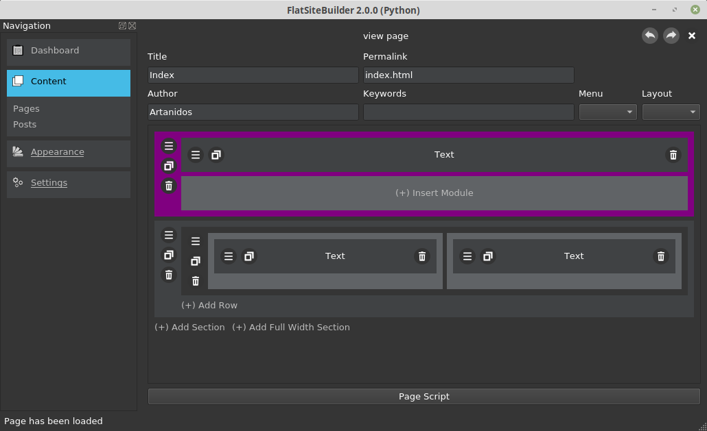

# FlatSiteBuilder

This desktop app is working as a content mangement system and is producing a flat file web content to use with github pages or any other service provider.
I have been inspired by Wordpress and the Divi - PageBuilder.

Have a look at our web site: https://artanidos.github.io/FlatSiteBuilder

# Syntax
The syntax for the templates is based on [Django](https://www.djangoproject.com/start/). That also means that we render the HTML using [Django](https://www.djangoproject.com/start/).

## Variable
{{ varname }}

## Includes


## Loop

    {{ page.title }}


## Contitional


    do something


## Contact
If you have any feature requests then just send me an email with your ideas to artanidos@gmail.com

## Donations
If you like to support my work on the FlatSiteBuilder you are invited to make a donation.

